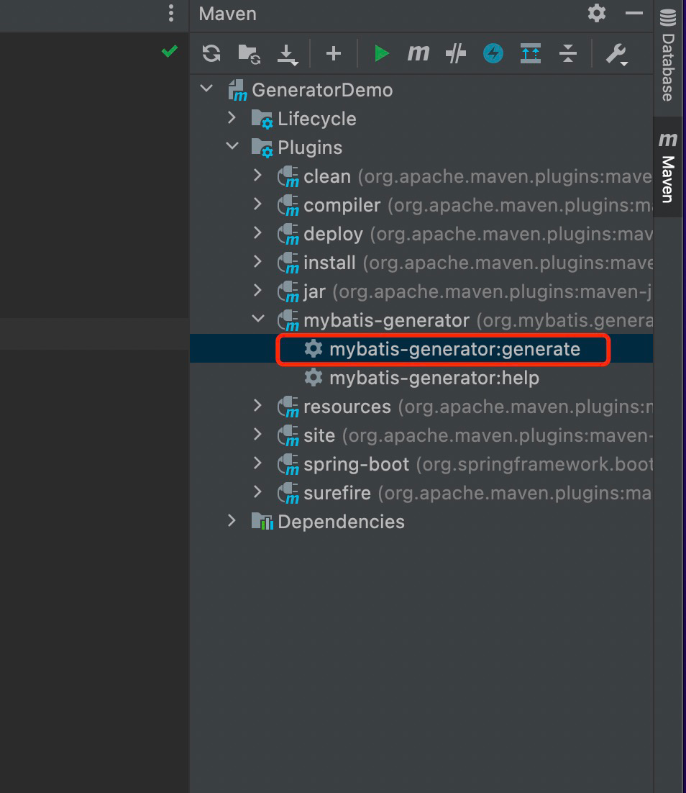

# GeneratorDemo

# Getting Started

My Batis Generator Demo

可以快速生成 entity、mapper 又可以不用写xml 

官网文档: http://mybatis.org/generator/index.html

# set up
1、pom.xml 引入依赖

2、数据库文件 注意修改database --> jdbc.properties

3、application.yml 注意修改database -->配置数据库

4、配置generatorConfig.xml

5、点击

6、作者
  
